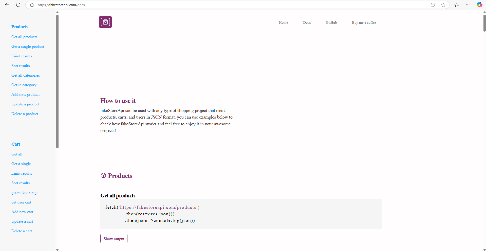

# This Project for who are very new to REST API's as well as API Integration

we are using the Third party API that is FakeStoreApi.com for more details you can visit documentation.

#### PreRequsites

1. Java 1.8
2. SQL Commands and Querying
3. SQL Schema Design
4. SQL Cardinality
5. LLD (Low-Level Design)

   * Cardinality
   * Design Patterns
   * UML Designs and Class Design
6. HLD (High-Level Design)

   * RDBMS
   * NoSQL Databases
   * Caching
   * Messaging Queues (Kafka/Zookeeper)
   * Load Balancers / Rate Limiters / DNS / API Gateways
   * Basic Networking (IP, TCP, LAN, WAN, WebSockets, WebHooks)
   * Sharding Databases / Consistent Hashing
   * CAP and PACELC Theorem
   * Master-Slave Architecture
   * Microservices and Patterns
   * Latency Chart
   * HTTP Protocols
   * HTTP Status Codes
   * API Types
   * Exception Handling
   * Some Hands-on Practice Case Studies

# Tables

1. Product
2. Cart
3. User

These are the 3 tables in FakeStoreAPI,

# API's What we Developed in this project

1. [GET Product By Id](https://fakestoreapi.com/products/{1}) GET a Single Product
2. [GET All Products](https://fakestoreapi.com/products) GET all Products

## Fake Store API Documentation

* ### [Products](https://fakestoreapi.com/docs#products)
* [Get all products](https://fakestoreapi.com/docs#p-all)
* [Get a single product](https://fakestoreapi.com/docs#p-single)
* [Limit results](https://fakestoreapi.com/docs#p-limit)
* [Sort results](https://fakestoreapi.com/docs#p-sort)
* [Get all categories](https://fakestoreapi.com/docs#p-categories)
* [Get in category](https://fakestoreapi.com/docs#p-category)
* [Add new product](https://fakestoreapi.com/docs#p-new)
* [Update a product](https://fakestoreapi.com/docs#p-update)
* [Delete a product](https://fakestoreapi.com/docs#p-delete)
* ### [Cart](https://fakestoreapi.com/docs#cart)
* [Get all](https://fakestoreapi.com/docs#c-all)
* [Get a single](https://fakestoreapi.com/docs#c-single)
* [Limit results](https://fakestoreapi.com/docs#c-limit)
* [Sort results](https://fakestoreapi.com/docs#c-sort)
* [get in date range](https://fakestoreapi.com/docs#c-date)
* [get user cart](https://fakestoreapi.com/docs#c-user-cart)
* [Add new cart](https://fakestoreapi.com/docs#c-new)
* [Update a cart](https://fakestoreapi.com/docs#c-update)
* [Delete a cart](https://fakestoreapi.com/docs#c-delete)
* ### [User](https://fakestoreapi.com/docs#user)
* [Get all](https://fakestoreapi.com/docs#u-all)
* [Get a single](https://fakestoreapi.com/docs#u-single)
* [Limit results](https://fakestoreapi.com/docs#u-limit)
* [Sort results](https://fakestoreapi.com/docs#u-sort)
* [Add](https://fakestoreapi.com/docs#u-new)
* [Update](https://fakestoreapi.com/docs#u-update)
* [Delete](https://fakestoreapi.com/docs#u-delete)
